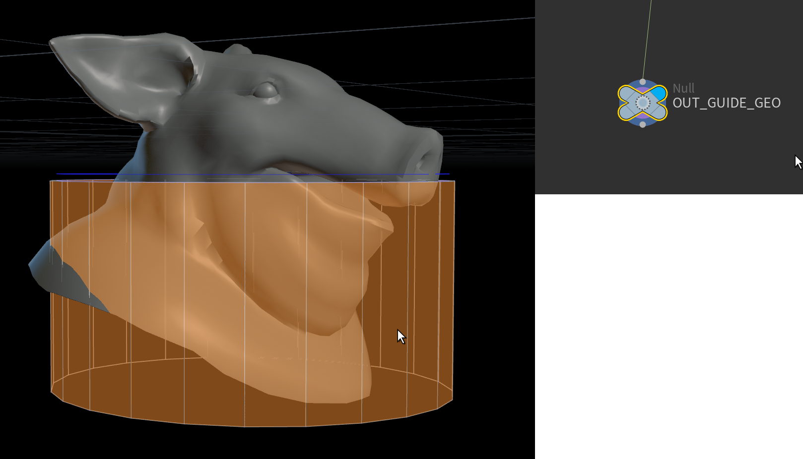

Houdini-Scripting-Snippets
### Common Links
[All Houdini Environment Variables](https://www.sidefx.com/docs/houdini/ref/env.html)
[HScript Reference](https://www.sidefx.com/docs/houdini/expressions/index.html)


### Get the type of a node

```python
node.type() # get the type of a node
```

### Copy node info to clipboard

```python
import subprocess
def copy2clip(txt):
    cmd='echo '+txt.strip()+'|clip'
    return subprocess.check_call(cmd, shell=True)

#copy the node types icon
copy2clip(node.type().icon())

#copy a nodes rgb color
rgbVal = node.color().rgb()
copy2clip(f'{rgbVal[0]}, {rgbVal[1], rgbVal[2]}')
```

### Get the currently active Network Editor

```python
import toolutils
curNetwork = toolutils.networkEditor()
```
### Get the currently active Scene Viewer Editor

```python
import toolutils
curViewer = toolutils.sceneViewer()
```
### Open the type properties dialog
```python
selected = hou.selectedNodes()[0]
hou.ui.openTypePropertiesDialog(selected) 
```

Set a custom shape for a node in the OnCreated Script

```python
kwargs["node"].setColor(hou.Color((1, 0.725, 0)))
kwargs["node"].setUserData('nodeshape', 'circle')
```


### All Custom Shapes Options

```python
'rect', 'bone', 'bulge', 'bulge_down', 'burst', 'camera', 'chevron_down', 'chevron_up', 'cigar', 'circle', 'clipped_left', 'clipped_right', 'cloud', 'diamond', 'ensign', 'gurgle', 'light', 'null', 'oval', 'peanut', 'pointy', 'slash', 'squared', 'star', 'tabbed_left', 'tabbed_right', 'tilted', 'trapezoid_down', 'trapezoid_up', 'wave'
```

###

```python

# Place inside an HDA's view state script
import hou
import viewerstate.utils as su

BLACK = [0, 0, 0]
DARK_GREY = [0.341176471, 0.341176471, 0.341176471]
LIGHT_GREY = [0.62745098, 0.62745098, 0.62745098]
WHITE = [1.0, 1.0, 1.0]
RED = [0.678431373, 0.137254902, 0.137254902]
BLUE = [0.164705882, 0.294117647, 0.843137255]
GREEN = [0.11372549, 0.411764706, 0.078431373]
BROWN = [0.505882353, 0.290196078, 0.098039216]
PURPLE = [0.505882353, 0.149019608, 0.752941176]
LIGHT_GREEN = [0.505882353, 0.77254902, 0.478431373]
LIGHT_BLUE = [0.615686275, 0.68627451, 1.0]
CYAN = [0.160784314, 0.815686275, 0.815686275]
ORANGE = [1.0, 0.57254902, 0.2]
YELLOW = [1.0, 0.933333333, 0.2]
TAN = [0.91372549, 0.870588235, 0.733333333]
PINK = [1.0, 0.803921569, 0.952941176]

POINT_COLOR=BLUE
LINE_COLOR=WHITE
FACE_COLOR =ORANGE

POINT_SCALE=1
FACE_ALPHA=.5
LINE_ALPHA=.5
POINT_ALPHA=.8

SHOW_POINTS = True
SHOW_LINES = True
SHOW_FACES = True


GUIDE_GEO_NAME = "OUT_GUIDE_GEO"

class State(object):
    def __init__(self, state_name, scene_viewer):
        self.state_name = state_name
        self.scene_viewer = scene_viewer
   
  
    def set_point(self):
        params = { 
            "radius": POINT_SCALE,
            "color1" : (POINT_COLOR[0], POINT_COLOR[1], POINT_COLOR[2], POINT_ALPHA)
            }
        self.point.setParams(params)
  
    def set_line(self):
        params = { 
            "color1" : (LINE_COLOR[0], LINE_COLOR[1], LINE_COLOR[2], LINE_ALPHA)
            }
        self.line.setParams(params)
  
    def set_face(self):
        params = { 
            "color1" : (FACE_COLOR[0], FACE_COLOR[1], FACE_COLOR[2], FACE_ALPHA)
            }
        self.face.setParams(params)
  
  
    # On state enter 
    def onEnter(self, kwargs):
        self.node = kwargs["node"]

        # Drawable setup
        # - get guide goemetry
        guide_geo = self.node.node("OUT_GUIDE_GEO").geometry()
  
        self.point = hou.GeometryDrawable(self.scene_viewer, hou.drawableGeometryType.Point, "Guide_Point", guide_geo)
        self.line = hou.GeometryDrawable(self.scene_viewer, hou.drawableGeometryType.Line, "Guide_Line", guide_geo)
        self.face = hou.GeometryDrawable(self.scene_viewer, hou.drawableGeometryType.Face, "Guide_Face", guide_geo)
  
        # Set drawable parm. dictionary.
        self.set_point()
        self.set_line()
        self.set_face()

        self.point.show(SHOW_POINTS)
        self.line.show(SHOW_LINES)
        self.face.show(SHOW_FACES)


    # On draw - calls every time the scene viewer updates.
    def onDraw(self, kwargs):
        handle = kwargs["draw_handle"] 
        self.point.draw(handle)
        self.line.draw(handle)
        self.face.draw(handle)

    def onDrawInterrupt(self, kwargs):
        self.onDraw(kwargs)

def createViewerStateTemplate():
    """ Mandatory entry point to create and return the viewer state 
        template to register. """

    state_typename = kwargs["type"].definition().sections()["DefaultState"].contents()
    state_label = "Display properties"
    state_cat = hou.sopNodeTypeCategory()

    template = hou.ViewerStateTemplate(state_typename, state_label, state_cat)
    template.bindFactory(State)
    template.bindIcon(kwargs["type"].icon())

    template.bindNodeParmChangeEvent(('enable_point', 'POINT_COLOR', 'point_alpha', 'point_scale',
                                      'enable_line', 'LINE_COLOR', 'line_alpha',
                                      'enable_face', 'FACE_COLOR', 'face_alpha', ))


    return template

```




### Params
"Get" Min/Max Button Callback
```python
# min
node = hou.pwd(); attribName=node.parm("attrib_name").eval();geo = node.geometry();values = geo.pointIntAttribValues(attribName);node.parm("min").set(min(values))
# max
node = hou.pwd(); attribName=node.parm("attrib_name").eval();geo = node.geometry();values = geo.pointFloatAttribValues(attribName);node.parm("max").set(max(values))
```

### Disable When
# Disable a parm based on a toggle parms value
```python
{ rad_use_timeline == 1 }
```

Other disable when operations
So you could do { parma == "" parmb == "" } this would mean they both need to be true in order to work an (and) operation. Or if { parma == "" } { parmb == "" } would be an (or) operation. You can also do ==, !=, <, >, >=, <=, =~ (matches pattern), !~ (doesn’t match pattern) as additional operations. What is a actually quite common is to make a parameter that is invisible (or under a hidewhen under an advanced set of options) that you can use to hide and disable parameter and folder menus.


### Add Geo selector for parm action button

Point
```python
import soputils
kwargs['geometrytype'] = (hou.geometryType.Points,)
kwargs['inputindex'] = 0
soputils.selectGroupParm(kwargs)
```


### Write callbacks in HDA Python Module
1. Go to type properties > Scripts > Select "Python Module" for event handler
2. Write the code
3. You can call the code using `hou.phm().myFunc()` inside a parameter callback, for example


### Param Expression Utilities
I add these to the hou.py file in C:\Program Files\Side Effects Software\Houdini 19.5.303\houdini\python3.9libs so I can easily access them at any time.

```python

def wiggle(freq, amp, octaves=1, amp_mult=0.5, t=0.0):
    total_value = 0.0
    total_amp = 0.0
    for i in range(octaves):
        np.random.seed(int(t * freq * (2 ** i)))  # Seed with time and frequency
        noise = np.random.randn()  # Generate a random number from normal distribution
        total_value += noise * (amp * (amp_mult ** i))
        total_amp += amp * (amp_mult ** i)
    
    return total_value / total_amp

```

Button callback to set an float width and height parameter once an image file is loaded

```python
node=hou.pwd();img_size = hou.imageResolution(node.parm("image_path").eval());node.parm("width").set(img_size[0]);node.parm("height").set(img_size[1])
```

detail("/obj/geo1/detailwrangle2", "mid", 0)


```python
# get a reference to the scene view 
viewer = hou.ui.paneTabOfType(hou.paneTabType.SceneViewer)
```

```python
# set a selected cameras position to the current viewport transformation
viewer = hou.ui.paneTabOfType(hou.paneTabType.SceneViewer)
viewports = viewer.viewports()
cur = viewer.curViewport()
cam_node = hou.selectedNodes()[0]
cur.saveViewToCamera(cam_node)
viewer.setPromptMessage("Set camera to view")
```

HExpression to get the position of the first point from a given geometry
```
point("/obj/AVOID/random_selection1", 0, "P", 0)
```
